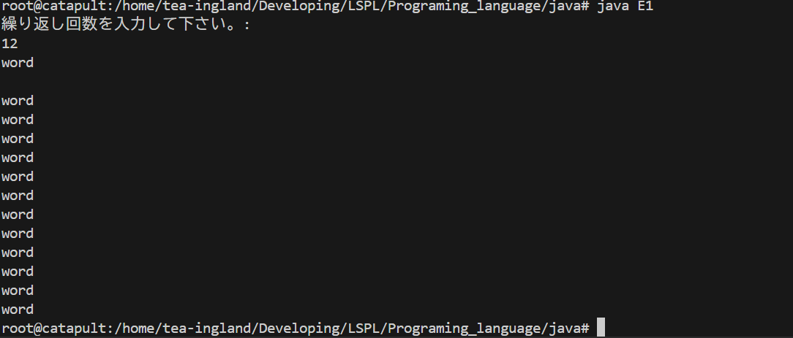

#　使用言語
- c
- cpp
- cs
- java

- js
- ts

- py

- go

# 例題
## E1 基礎の基礎
入力:　int n
 string word
出力: n回「word」を出力したあと「終了」

## E2

## E3 stackの実装
入力:int N
int a[0], a[1]...a[N-1]
出力: a[N-1],a[N-2]...a[0]
## E4 Queueの実装
入力:int N
int a[0], a[1]...a[N-1]
出力: a[0],a[1]...a[N-1]
## E5 InsertSortの実装
入力:int N
int a[0], a[1]...a[N-1]
出力: a[]を挿入ソートで降順にして出力
## E6 HeapSortの実装
## E7 QuickSortの実装
## E8 ダイクストラ法
## E9 動的計画法
## E10 
## E11 
## E12 
## E13 
## E14 
## E15 
## E16 
## E17 
## E18 
## E19 
## E20 

